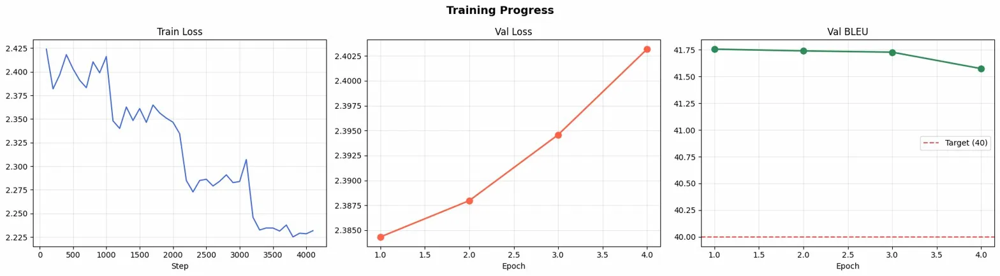

# 🇬🇧 → 🇫🇷 English to French Neural Machine Translation

This project is upgrade from the [Previous Model](https://github.com/AdityaKr015/NMT-Eng-to-French-Seq2Seq-Bahdanau-Attention). 

A high-quality Neural Machine Translation (NMT) system trained on the **WMT14 English–French dataset** using a **Transformer-based MarianMT architecture**.

Fine-tuned Helsinki-NLP/opus-mt-tc-big-en-fr on WMT14 (fr-en) achieving 41.76 BLEU on the validation set exceeding the 40 BLEU target and deploys an interactive translation demo using **Gradio + Hugging Face Spaces**. 

## 🚀 Demo

Live Demo: [](https://huggingface.co/spaces/AdiKr25/En-fr-WMT14-41_Bleu-41_chrF-63)

Model Hub: [](https://huggingface.co/AdiKr25/En-fr-WMT14-41_Bleu-41_chrF-63)


## 📓 Training Notebook

The full model training pipeline can be found here:

[Open Notebook](notebook/eng-to-french-transformers.ipynb)

## Project Overview

In this project, I explored transformer-based models for machine translation to learn about transformer and get hands on experience. The task focuses on English-to-French translation using a large-scale parallel dataset.

The main goal of this project is to:

- Understand the full workflow of transformer-based translation.
- Experiment with fine-tuning a pre-trained model.
- Evaluate translation quality using standard metrics(like BLEU,chrF,TER.

# 🧠 Model Architecture

Transformer based sequence-to-sequence model:


### Pipeline Workflow

1. **Data Loading**: Load WMT14 (fr-en) translation pairs — 80,000 sampled from 40.8M available
2. **Data Cleaning**:
   - Remove pairs shorter than 3 tokens per side
   - Filter by sentence length (max 128 words)
   - Length ratio filtering (EN/FR ratio kept between 0.5–1.5)
3. **Preprocessing**:
   - Split data (90% train, 5% val, 5% test)
   - Tokenization with MarianTokenizer (SentencePiece)
   - Padding token replaced with -100 so loss ignores it
4. **Training**:
   - Fine-tune `Helsinki-NLP/opus-mt-tc-big-en-fr` (232.7M params)
   - Mixed precision training (FP16 on GPU)
   - Cosine LR scheduler with 10% warmup
   - Label smoothing (0.1) for better generalization
   - Early stopping with patience=3
5. **Evaluation**:
   - BLEU, chrF, TER score computation on test set
   - Attention heatmap visualization per translation
6. **Deployment**:
   - Model saved to Hugging Face Hub
   - Gradio web app served via Hugging Face Spaces
   
### Base model:

Helsinki-NLP/opus-mt-tc-big-en-fr (232.7M parameters)

Vocab Size: 53,017 tokens

Tokenizer: MarianTokenizer (SentencePiece)

## 📊 Dataset

### Source: WMT14 fr-en (~40.8M pairs available; 80,000 sampled)

### Cleaning rules applied:

- Remove sentences shorter than **3 words**
- Remove sentences longer than **128 tokens**
- Remove extreme length mismatches
- English/French ratio constraint
- Length ratio between EN/FR kept between 0.5 and 1.5

### Result: 74,359 clean pairs → split into Train / Val / Test (90 / 5 / 5)

| Split | Samples |
|------|--------|
| Train | 66,923 |
| Validation | 3,718 |
| Test | 3,718 |

# ⚙️ Training Configuration

| Parameter | Value |
|--------|------|
| Base Model | opus-mt-tc-big-en-fr |
| Dataset| WMT14 (fr-en) |
| Epochs | 7(4 (early stopping) |
| Train Samples | 66,923 (after cleaning |
| Learning Rate | 2e-5 |
| Batch Size | 32 |
| Gradient Accumulation | 2 |
| Effective Batch | 64 (32 × 2 grad accum) |
| LR Scheduler | Cosine |
| Warmup Ratio | 10% |
| FP16 | Enabled |
| Label Smoothing | 0.1 |
| Beam Size | 8 |
| Hardware | Tesla P100 16GB VRAM |
| Training Time | ~174 mins |

# 📈 Results

### Validation Metrics

| Metric | Score |
|------|------|
| BLEU | **41.76** |
| BLEU-1 | 65.29 |
| BLEU-2 | 46.58 |
| BLEU-3 | 36.39 |
| BLEU-4 | 29.19 |
| Loss | 2.38 |

### Test Metrics

| Metric | Score |
|------|------|
| BLEU | **41.13** |
| chrF | **63.56** |
| TER | 52.44 |

- BLEU Score: 41.76 on validation, 41.14 on test
- chrF Score: 63.56 
- TER: 52.44 (lower is better)

A BLEU score above 40 is considered human readable, fluent translation,the model reliably produces natural French output that closely mirrors reference translations.

Achieving this on just ~67k samples (out of 40M available) demonstrates that fine-tuning a strong pretrained model (Helsinki-NLP) can yield near professional quality even with limited data.

# 📊 Training Curves

### Loss and BLEU progression during training:



- Train loss steadily decreases from ~2.42 → ~2.23
- Val loss shows mild overfitting after epoch 1 (early stopping triggered at epoch 4)
- BLEU remains stable at ~41.7 across epochs — model generalizes well

# 📊 Dataset Statistics

### Sentence length distribution:


# 🖥️ Interactive Demo

The project includes a **Gradio interface** deployed on HuggingFace Spaces.

### Features:

- English → French translation  
- Beam search decoding  
- Attention visualization heatmap  

### Example:

Input:
The sun sets slowly over the horizon.

Output:
Le soleil se couche lentement à l'horizon.

The attention visualization helps interpret which source words influence each translated token.


# 📦 Installation

```bash
pip install -r requirements.txt
```

### Dependencies include:

- `transformers`: Hugging Face transformers library
- `torch`: PyTorch deep learning framework
- `datasets`: Hugging Face datasets library
- `sentencepiece`: Unsupervised tokenizer for subword segmentation
- `sacrebleu`: BLEU score computation
- `evaluate`: Hugging Face evaluation library for computing ML metrics
- `gradio`: Web UI framework for deploying interactive ML demos

## ▶️ Run the App

```bash
python app.py
```

The app loads the model from HuggingFace Hub and launches a Gradio interface.

### The interface implementation is in:

```bash
app.py
```

### Example from the translation pipeline:

model.generate(num_beams=8,max_length=256)

The model is loaded from the HuggingFace model hub:

https://huggingface.co/AdiKr25/En-fr-WMT14-41_Bleu-41_chrF-63

# 📂 Project Structure
```
NMT-English-French/
│
├── app.py               # Gradio app (Spaces entry point)
├── requirements.txt     # Python dependencies
├── README.md            # Project description
│
├── notebooks/
│   └── training.ipynb   # training notebook
│
├── images/
   ├── eda.png
   └── training_curves.png
```

# 🔬 Evaluation Metrics

Evaluation performed using:
- `SacreBLEU` : Measures n-gram overlap between predicted and reference translations. Score of 40+ is considered fluent, human-readable translation
- `chrF` : Character-level F-score, more sensitive to morphology and word endings. Score of 63.56 indicates strong character-level accuracy
- `TER` : Translation Edit Rate — measures how many edits are needed to fix the prediction into the reference. Lower is better; 52.44 is competitive for EN→FR

Metrics computed using the `evaluate` and `sacrebleu` libraries.
Training and evaluation pipeline code is available in the notebook.

# 🔮 Future Improvements

Possible improvements:

- Train on 200k+ samples
- Increase max sequence length to 256
- Use LoRA fine-tuning for efficiency
- Train a custom transformer instead of fine-tuning

Expected improvement:

+3 to +5 BLEU

### 📜 License

MIT License

### 👨‍💻 Author

Aditya Kumar (AI / ML Student)

Project created for learning Neural Machine Translation and Transformer training pipelines.

